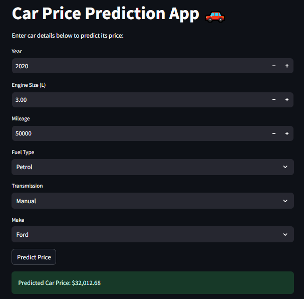

# Car Price Prediction 🚗

A Streamlit-powered car price prediction app and training notebook that demonstrates a reproducible ML pipeline for estimating used car prices using scikit-learn and pandas.

---

## 🚀 Features

- **Interactive Streamlit UI** for fast price predictions (`UI/UI.py`) ✅
- **Model training notebook** with EDA, feature engineering, and model evaluation (`model.ipynb`) 📊
- **Reusable artifacts** exported with `joblib` (`car_price_model.pkl`, `scaler.pkl`, `features.pkl`) 🔁
- **Lightweight, reproducible stack**: pandas, scikit-learn, joblib, Streamlit 📦

---

## 💡 Quick start (development)

1. Clone the repo:

```bash
git clone <repo-url>
cd "car-price-prediction"
```

1. (Recommended) Create a virtual environment and activate it:

```bash
python -m venv .venv
# Windows
.venv\Scripts\activate
# macOS / Linux
source .venv/bin/activate
```

1. Install dependencies:

```bash
pip install -r requirements.txt
```

1. Launch the Streamlit UI:

```bash
streamlit run UI/UI.py
```

Open the displayed local URL in your browser to use the app.

---

## ▶️ Usage examples

<p align="center">
  
</p>

### Run the web UI (Streamlit)

```bash
streamlit run UI/UI.py
```

### Use the model programmatically

Example Python snippet to load artifacts and make a single prediction:

```python
import joblib
import pandas as pd

# Load artifacts (must exist in repo root)
model = joblib.load("car_price_model.pkl")
scaler = joblib.load("scaler.pkl")
features = joblib.load("features.pkl")

# Create a single-row input (example values)
X = pd.DataFrame(
    [[2015, 2.0, 50000, 0, 1, 0, 0, 0, 1, 1]],
    columns=features
)

# Scale numeric features (example column names: 'Year', 'Engine Size', 'Mileage')
X[["Year", "Engine Size", "Mileage"]] = scaler.transform(
    X[["Year", "Engine Size", "Mileage"]]
)

pred = model.predict(X)[0]
print(f"Predicted price: ${pred:,.2f}")
```

> Tip: See `UI/UI.py` for a working example of how user inputs are encoded for prediction.

---

## 🗂️ Project structure

```
Car Price Prediction/
├─ CarPrice_Dirty.csv        # Raw or example dataset
├─ model.ipynb               # Notebook: EDA, training pipeline, evaluation
├─ requirements.txt          # Python dependencies
├─ car_price_model.pkl       # (expected) trained model artifact
├─ scaler.pkl                # (expected) numeric scaler
├─ features.pkl              # (expected) ordered feature list
└─ UI/
   └─ UI.py                 # Streamlit app for predictions
```

---

## 🛠️ Tech stack & dependencies

- Language: **Python 3.8+** 🐍
- Key libraries: `pandas`, `numpy`, `scikit-learn`, `joblib`, `streamlit`
- Dev / Notebooks: `jupyter`, `ipykernel`
- Optional dev tools: `pytest`, `black`, `flake8`

(See `requirements.txt` for exact versions.)

---

## 🤝 Contribution guidelines

Contributions are welcome! A suggested workflow:

1. Fork the repository and create a topic branch (`feature/your-feature`).
2. Write tests for any new behavior and ensure existing tests pass.
3. Follow the project style (e.g., `black`/`flake8`) and keep commits small & focused.
4. Open a PR describing your change, why it’s needed, and any notes for reviewers.

If you plan to add model training changes, include:

- A reproducible data preprocessing step in `model.ipynb` or a script.
- Clear notes about model selection, hyperparameters, and evaluation metrics.

---

## ✅ Notes for recruiters & maintainers

- The project demonstrates a full small-scale ML workflow (data → features → model → UI).
- Training is reproducible from `model.ipynb`. Trained artifacts are loadable via `joblib` for quick integration into the UI or other services.
- Easy to extend: add more features, swap regression models, or serialize for deployment (FastAPI, Docker, etc.).

---

## 📄 License

This project is licensed under the **MIT License** — see the `LICENSE` file for the full text. ⚖️

---

## 📫 Contact

Connect with me on [LinkedIn](https://www.linkedin.com/in/shehab-saber-a78746355)

---

Thanks for checking out this project — feel free to run the app locally and experiment with the model! 🚘
